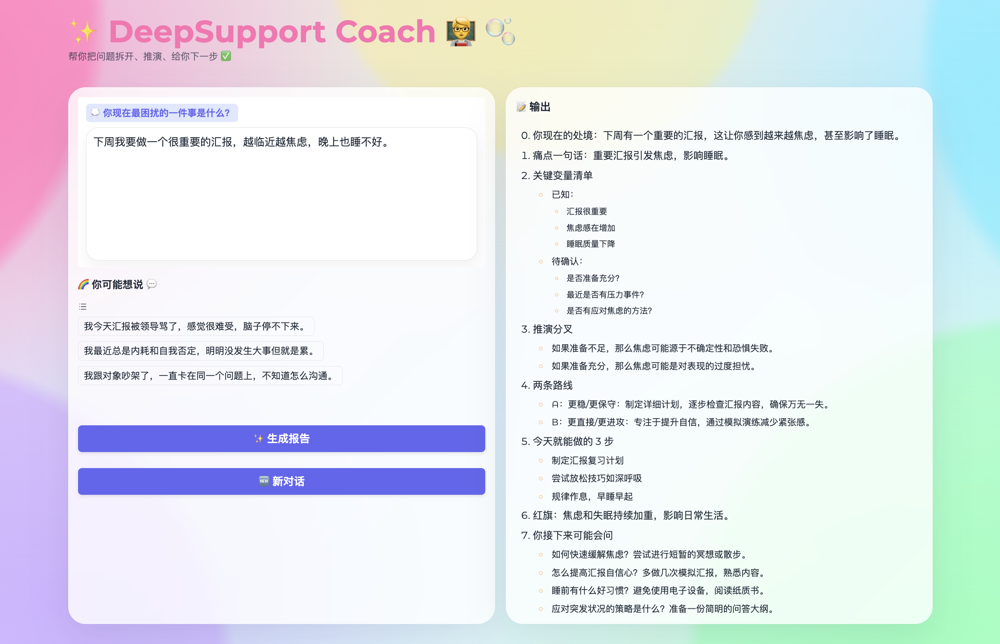
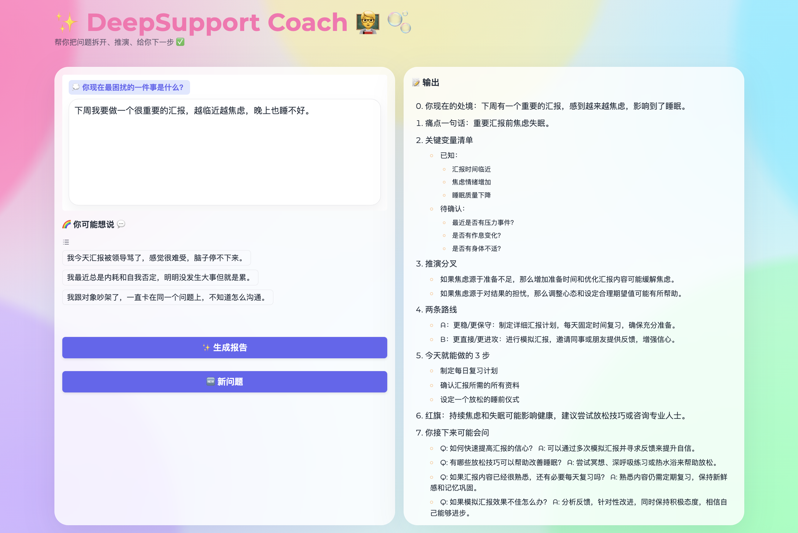
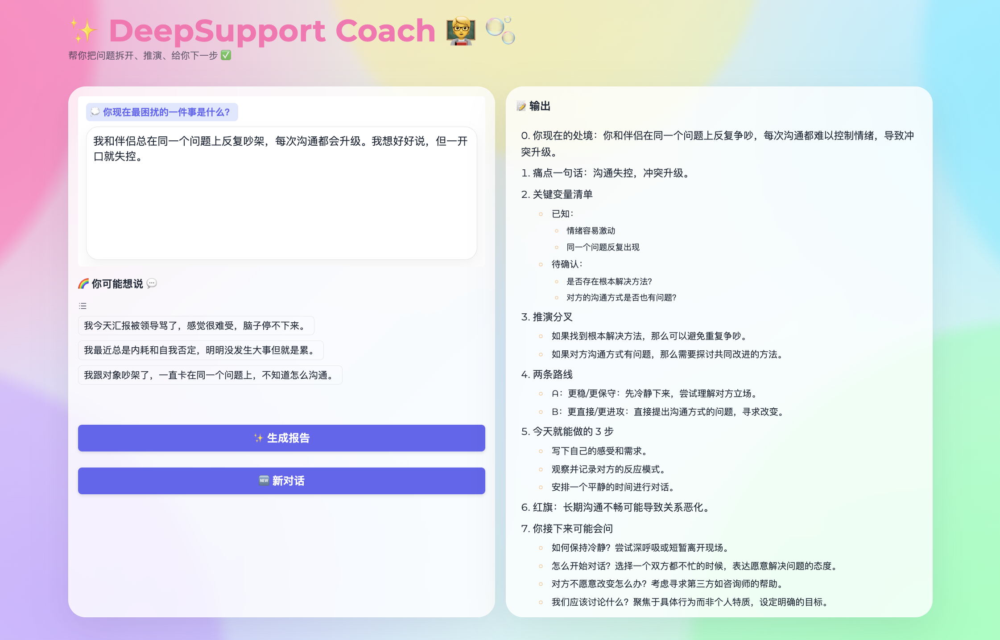
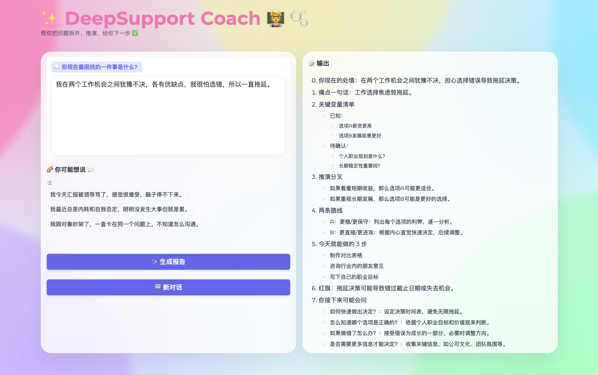
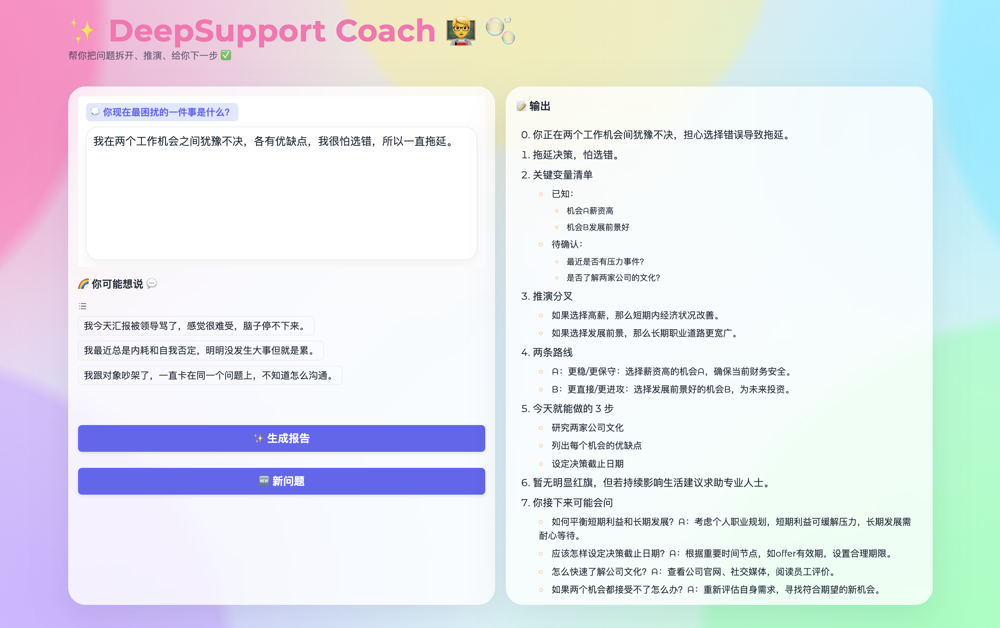
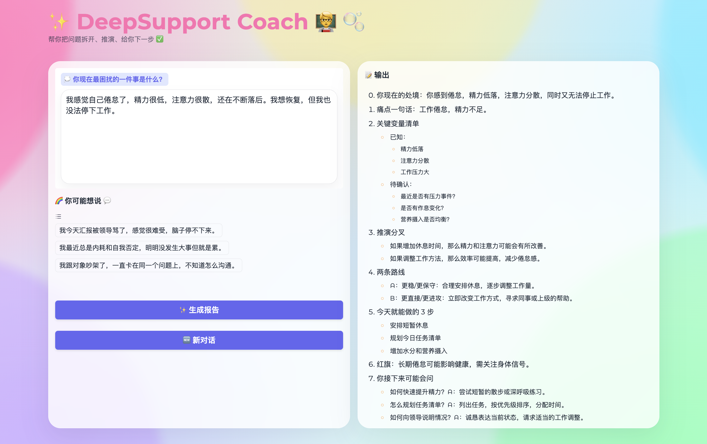
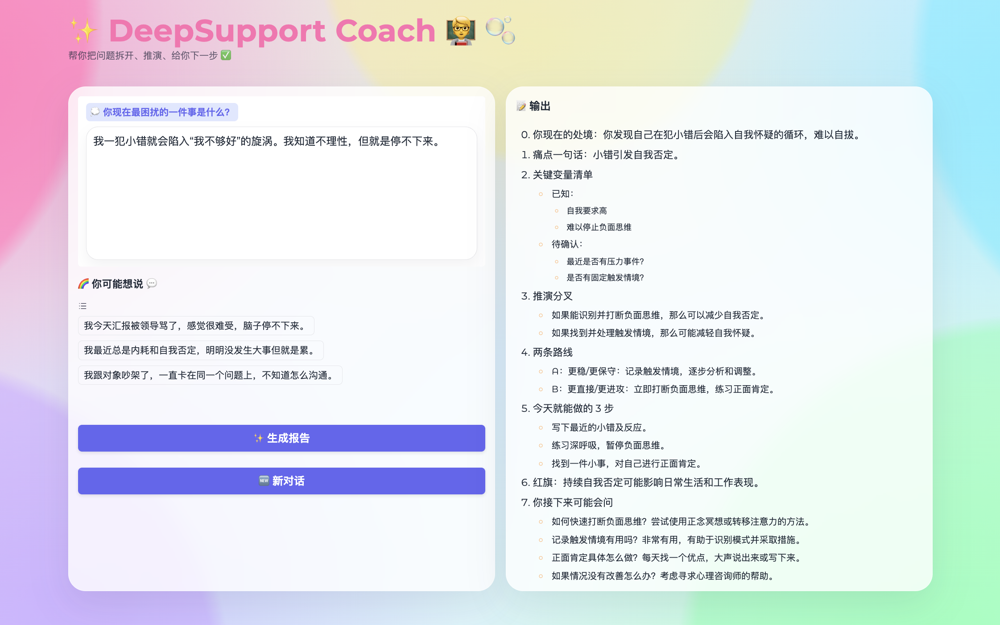
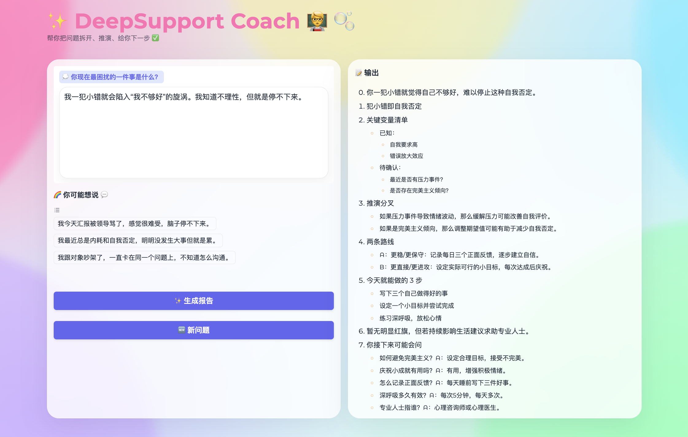

## Example 1 | Presentation anxiety

**Input (ZH)**  
下周我要做一个很重要的汇报，越临近越焦虑，晚上也睡不好。

**Input (EN)**  
I have an important presentation next week. The closer it gets, the more anxious I feel, and I can’t sleep well.

### Coach — OSS
**Output (ZH)**  
0.你现在的处境：下周有一个重要的汇报，这让你感到越来越焦虑，甚至影响了睡眠。
1.痛点一句话：重要汇报引发焦虑，影响睡眠。
2.关键变量清单
。 已知：
    。 汇报很重要
    。 焦虑感在增加
    。 睡眠质量下降
。 待确认：
    。 是否准备充分？
    。 最近是否有压力事件？
    。 是否有应对焦虑的方法？
3.推演分叉
。 如果准备不足，那么焦虑可能源于不确定性和恐惧失败。
。 如果准备充分，那么焦虑可能是对表现的过度担忧。
4.两条路线
。 A：更稳/更保守：制定详细计划，逐步检查汇报内容，确保万无一失。
。 B：更直接/更进攻：专注于提升自信，通过模拟演练减少紧张感。
5.今天就能做的3步
。 制定汇报复习计划
。 尝试放松技巧如深呼吸
。 规律作息，早睡早起
6.红旗：焦虑和失眠持续加重，影响日常生活。
7.你接下来可能会问
。 如何快速缓解焦虑？尝试进行短暂的冥想或散步。
。 怎么提高汇报自信心？多做几次模拟汇报，熟悉内容。
。 睡前有什么好习惯？避免使用电子设备，阅读纸质书。
。 应对突发状况的策略是什么？准备一份简明的问答大纲。

**Output (EN)**  
0.Your current situation: You have an important presentation next week, which is making you increasingly anxious and has even affected your sleep.
1.One-sentence pain point: An important presentation triggers anxiety and affects sleep.
2.Key variables list
。 Known:
    。 The presentation is important
    。 Anxiety is increasing
    。 Sleep quality has declined
。 To confirm:
    。 Are you sufficiently prepared?
    。 Have there been any recent stressful events?
    。 Do you have any ways to cope with anxiety?
3.Branching reasoning
。 If preparation is insufficient, then anxiety may come from uncertainty and fear of failure.
If preparation is sufficient, then anxiety may be excessive worry about performance.
4.Two routes
。 A: steadier / more conservative: Make a detailed plan, check the presentation content step by step, and ensure everything is foolproof.
。 B: more direct / more aggressive: Focus on building confidence and reduce nervousness through mock rehearsals.
5.Three steps you can do today
。 Make a review plan for the presentation
。 Try relaxation techniques such as deep breathing
。 Keep a regular schedule, go to bed early and wake up early
6.Red flag: Anxiety and insomnia continue to worsen and affect daily life.
7.You may ask next
。 How to quickly relieve anxiety? Try a brief meditation or a walk.
。 How to improve presentation confidence? Do several mock presentations and become familiar with the content.
。 What are good bedtime habits? Avoid using electronic devices and read a paper book.
。 What is a strategy for dealing with unexpected situations? Prepare a concise Q&A outline.

### Coach — Full
**Output (ZH)**  
0.你现在的处境：下周有一个重要的汇报，感到越来越焦虑，影响到了睡眠。
1.痛点一句话：重要汇报前焦虑失眠。
2.关键变量清单
。 已知：
    。 汇报时间临近
    。 焦虑情绪增加
    。 睡眠质量下降
。 待确认：
    。 最近是否有压力事件？
    。 是否有作息变化？
    。 是否有身体不适？
3.推演分叉
。 如果焦虑源于准备不足，那么增加准备时间和优化汇报内容可能缓解焦虑。
。 如果焦虑源于对结果的担忧，那么调整心态和设定合理期望值可能有所帮助。
4.两条路线
。 A：更稳/更保守：制定详细汇报计划，每天固定时间复习，确保充分准备。
。 B：更直接/更进攻：进行模拟汇报，邀请同事或朋友提供反馈，增强信心。
5.今天就能做的3步
。 制定每日复习计划
。 确认汇报所需的所有资料
。 设定一个放松的睡前仪式
6.红旗：持续焦虑和失眠可能影响健康，建议尝试放松技巧或咨询专业人士。
7.你接下来可能会问
。Q：如何快速提高汇报的信心？A：可以通过多次模拟汇报并寻求反馈来提升自信。
。Q：有哪些放松技巧可以帮助改善睡眠？A：尝试冥想、深呼吸练习或热水浴来帮助放松。
。Q：如果汇报内容已经很熟悉，还有必要每天复习吗？A：熟悉内容仍需定期复习，保持新鲜感和记忆巩固。
。Q：如果模拟汇报效果不佳怎么办？A：分析反馈，针对性改进，同时保持积极态度，相信自己能够进步。

**Output (EN)**  
0.Your current situation: You have an important presentation next week, feel increasingly anxious, and it has affected your sleep.
1.One-sentence pain point: Anxiety and insomnia before an important presentation.
2.Key variables list
。 Known:
    。 The presentation time is approaching
    。 Anxiety is increasing
    。 Sleep quality has declined
。 To confirm:
    。 Have there been any recent stressful events?
    。 Have there been any changes in your daily schedule?
    。 Do you have any physical discomfort?
3.Branching reasoning
。 If anxiety comes from insufficient preparation, then increasing preparation time and optimizing the presentation content may relieve anxiety.
。 If anxiety comes from worrying about the outcome, then adjusting your mindset and setting reasonable expectations may help.
4.Two routes
。 A: steadier / more conservative: Make a detailed presentation plan, review at a fixed time every day, and ensure sufficient preparation.
。 B: more direct / more aggressive: Do mock presentations and invite colleagues or friends to give feedback to build confidence.
5.Three steps you can do today
。 Make a daily review plan
。 Confirm all materials needed for the presentation
。 Set a relaxing bedtime ritual
6.Red flag: Persistent anxiety and insomnia may affect health; consider trying relaxation techniques or consulting a professional.
7.You may ask next
。Q：How to quickly increase presentation confidence? A: You can improve confidence through multiple mock presentations and seeking feedback.
。Q：What relaxation techniques can help improve sleep? A: Try meditation, deep breathing exercises, or a hot bath to help you relax.
。Q：If I am already very familiar with the presentation content, is it still necessary to review every day? A: Even if you are familiar, you still need regular review to keep it fresh and consolidate memory.
。Q：What if the mock presentation does not go well? A: Analyze the feedback and improve in a targeted way, while keeping a positive attitude and believing you can make progress.

---

## Example 2 | Relationship conflict

**Input (ZH)**  
我和伴侣总在同一个问题上反复吵架，每次沟通都会升级。我想好好说，但一开口就失控。

**Input (EN)**  
My partner and I keep arguing about the same issue. Every time we talk, it escalates. I don’t know how to communicate without losing control.

### Coach — OSS
**Output (ZH)**  
0.你现在的处境：你和伴侣在同一个问题上反复争吵，每次沟通都难以控制情绪，导致冲突升级。
1.痛点一句话：沟通失控，冲突升级。
2.关键变量清单
。 已知：
    。 情绪容易激动
    。 同一个问题反复出现
。 待确认：
    。 是否存在根本解决方法？
    。 对方的沟通方式是否也有问题？
3.推演分叉
。 如果找到根本解决方法，那么可以避免重复争吵。
。如果对方沟通方式有问题，那么需要探讨共同改进的方法。
4.两条路线
。 A：更稳/更保守：先冷静下来，尝试理解对方立场。
。 B： 更直接/更进攻：直接提出沟通方式的问题，寻求改变。
5.今天就能做的了步
。 写下自己的感受和需求。
。 观察并记录对方的反应模式。
。 安排一个平静的时间进行对话。
6.红旗：长期沟通不畅可能导致关系恶化。
7.你接下来可能会问
。 如何保持冷静？尝试深呼吸或短暂离开现场。
。 怎么开始对话？选择一个双方都不忙的时候，表达愿意解决问题的态度。
。 对方不愿意改变怎么办？考虑寻求第三方如咨询师的帮助。
。 我们应该讨论什么？聚焦于具体行为而非个人特质，设定明确的目标。

**Output (EN)**  
0.Your current situation: You and your partner repeatedly argue about the same issue, and it is hard to control emotions during communication, causing the conflict to escalate.
1.One-sentence pain point: Communication gets out of control, and conflict escalates.
2.Key variables list
。 Known:
    。 Emotions are easily triggered
    。 The same issue keeps recurring
。 To confirm:
    。 Is there a fundamental solution?
    。 Does the other person’s communication style also have problems?
3.Branching reasoning
。 If a fundamental solution is found, then repeated arguments can be avoided.
。 If the other person’s communication style has problems, then you need to explore ways to improve together.
4.Two routes
。 A: steadier / more conservative: Calm down first and try to understand the other person’s position.
。 B: more direct / more aggressive: Directly point out the issue with the communication style and seek change.
5.Three steps you can do today
。 Write down your feelings and needs.
。 Observe and record the other person’s reaction patterns.
。 Schedule a calm time to have a conversation.
6.Red flag: Long-term poor communication may lead to the relationship worsening.
7.You may ask next
。 How to stay calm? Try deep breathing or briefly leave the scene.
。 How to start the conversation? Choose a time when both of you are not busy, and express willingness to solve the problem.
。 What if the other person is unwilling to change? Consider seeking help from a third party such as a counselor.
。 What should we discuss? Focus on specific behaviors rather than personal traits, and set clear goals.

### Coach — Full
**Output (ZH)**  
0.你和伴侣因同一问题频繁争吵，每次沟通都难以控制情绪升级。
1.情绪控制困难导致沟通失败。
2.关键变量清单
。 已知：
    。 沟通时情绪易失控
    。 同一个问题反复出现
。 待确认：
    。 最近是否有压力事件？
    。 是否存在沟通技巧不足？
3.推演分叉
。 如果情绪管理得到改善，那么沟通效果可能提升。
。 如果沟通方式改变，那么双方可能找到解决办法。
4.两条路线
。 A：更稳/更保守：学习情绪管理技巧，逐步改善沟通。
。 B：更直接/更进攻：立即寻求专业咨询，快速找到解决方案。
5.今天就能做的了步
。写下触发情绪的具体情境。
。 练习深呼吸，保持冷静。
。提议伴侣一起阅读沟通技巧文章。
6.红旗：持续的情绪失控可能导致关系恶化。
7.你接下来可能会问
。 如何快速学会情绪管理？A：尝试冥想或正念练习。
。 有没有推荐的沟通技巧书籍？A：《非暴力沟通》。
。 怎么提议伴侣一起学习？A：表达希望改善沟通的愿望，邀请一起参加工作坊。
。 如果对方不愿意怎么办？A：先专注于自我提升，展示积极变化。
。 什么时候应该寻求专业帮助？A：当自我努力无效且情况恶化时。

**Output (EN)**  
0.You and your partner frequently argue because of the same issue, and it is hard to control emotions during communication, which escalates.
1.Difficulty controlling emotions leads to communication failure.
2.Key variables list
。 Known:
    。 Emotions easily get out of control during communication
    。 The same issue keeps recurring
。 To confirm:
    。 Have there been any recent stressful events?
    。 Is there a lack of communication skills?
3.Branching reasoning
。 If emotion management improves, then communication effectiveness may improve.
。 If the communication style changes, then both sides may find a solution.
4.Two routes
。 A: steadier / more conservative: Learn emotion management skills and gradually improve communication.
。 B: more direct / more aggressive: Seek professional counseling immediately to find a solution quickly.
5.Three steps you can do today
。 Write down the specific situations that trigger emotions.
。 Practice deep breathing and stay calm.
。 Suggest that your partner read an article about communication skills together.
6.Red flag: Continued loss of emotional control may lead to the relationship worsening.
7.You may ask next
。 How to quickly learn emotion management? A: Try meditation or mindfulness practice.
。 Are there recommended books on communication skills? A: “Nonviolent Communication.”
。 How to suggest that your partner learn together? A: Express the desire to improve communication and invite them to attend a workshop together.
。 What if the other person is unwilling? A: Focus on self-improvement first and show positive changes.
。 When should professional help be sought? A: When self-efforts do not work and the situation worsens.

---

## Example 3 | Career choice paralysis

**Input (ZH)**  
我在两个工作机会之间犹豫不决，各有优缺点，我很怕选错，所以一直拖延。

**Input (EN)**  
I’m stuck between two job options. Both have pros and cons, and I’m scared of choosing wrong. I keep delaying.

### Coach — OSS
**Output (ZH)**  
0.你现在的处境：在两个工作机会之间犹豫不决，担心选择错误导致拖延决策。
1.痛点一句话：工作选择焦虑致拖延。
2.关键变量清单
。 已知：
    。 选项A薪资更高
    。 选项B发展前景更好
。 待确认：
    。 个人职业规划是什么？
    。 长期稳定性重要吗？
3.推演分叉
。 如果看重短期收益，那么选项A可能更适合。
。 如果重视长期发展，那么选项B可能是更好的选择。
4.两条路线
。 A：更稳/更保守：列出每个选项的利弊，逐一分析。
。 B：更直接/更进攻：根据内心直觉快速决定，后续调整。
5.今天就能做的 3步
。 制作对比表格
。 咨询行业内的朋友意见
。 写下自己的职业目标
6.红旗：拖延决策可能导致错过截止日期或失去机会。
7.你接下来可能会问
。 如何快速做出决定？：设定决策时间表，避免无限拖延。
。 怎么知道哪个选项是正确的？：依据个人职业目标和价值观来判断。
。 如果做错了怎么办？：接受错误为成长的一部分，必要时调整方向。
。 是否需要更多信息才能决定？：收集关键信息，如公司文化、团队氛围等。

**Output (EN)**  
0.Your current situation: You are torn between two job opportunities, worried that choosing wrong will lead to delaying the decision.
1.One-sentence pain point: Anxiety about job choice leads to procrastination.
2.Key variables list
。 Known:
    。 Option A has a higher salary
    。 Option B has better development prospects
。 To confirm:
    。 What is your personal career plan?
    。 Is long-term stability important?
3.Branching reasoning
。 If you value short-term gains, then option A may be more suitable.
。 If you value long-term development, then option B may be a better choice.
4.Two routes
。 A: steadier / more conservative: List the pros and cons of each option and analyze them one by one.
。 B: more direct / more aggressive: Decide quickly based on intuition and adjust later.
5.Three steps you can do today
。 Make a comparison table
。 Ask friends in the industry for their opinions
。 Write down your career goals
6.Red flag: Procrastinating may cause you to miss the deadline or lose the opportunity.
7.You may ask next
。 How to make a decision quickly? Set a decision timeline and avoid endless procrastination.
。 How to know which option is correct? Judge based on personal career goals and values.
。 What if I choose wrong? Accept mistakes as part of growth and adjust direction if needed.
。 Do I need more information to decide? Collect key information, such as company culture and team atmosphere.

### Coach — Full
**Output (ZH)**  
0.你正在两个工作机会间犹豫不决，担心选择错误导致拖延。
1.拖延决策，怕选错。
2.关键变量清单
。 已知：
    。 机会A薪资高
    。 机会B发展前景好
。 待确认：
    。 最近是否有压力事件？
    。 是否了解两家公司的文化？
3.推演分叉
。 如果选择高薪，那么短期内经济状况改善。
。 如果选择发展前景，那么长期职业道路更宽厂。
4.两条路线
。 A：更稳/更保守：选择薪资高的机会A，确保当前财务安全。
。 B：更直接/更进攻：选择发展前景好的机会B，为未来投资。
5.今天就能做的3步
。 研究两家公司文化
。 列出每个机会的优缺点
。 设定决策截止日期
6.暂无明显红旗，但若持续影响生活建议求助专业人士。
7.你接下来可能会问
。 如何平衡短期利益和长期发展？A：考虑个人职业规划，短期利益可缓解压力，长期发展需耐心等待。
。 应该怎样设定决策截止日期？A：根据重要时间节点，如offer有效期，设置合理期限。
。 怎么快速了解公司文化？A：查看公司官网、社交媒体，阅读员工评价。
。 如果两个机会都接受不了怎么办？A：重新评估自身需求，寻找符合期望的新机会。

**Output (EN)**  
0.You are torn between two job opportunities and procrastinate because you worry about choosing wrong.
1.Procrastinating on the decision, afraid of choosing wrong.
2.Key variables list
。 Known:
    。 Opportunity A has a high salary
    。 Opportunity B has good development prospects
。 To confirm:
    。 Have there been any recent stressful events?
    。 Do you understand the culture of the two companies?
3.Branching reasoning
    。 If you choose the high salary, then your financial situation may improve in the short term.
    。 If you choose the development prospects, then your long-term career path may be broader.
4.Two routes
    。 A: steadier / more conservative: Choose opportunity A with higher salary to ensure current financial security.
    。 B: more direct / more aggressive: Choose opportunity B with better development prospects to invest in the future.
5.Three steps you can do today
。 Research the culture of the two companies
。 List the pros and cons of each opportunity
。 Set a decision deadline
6.No obvious red flags for now, but if it continues to affect life, consider seeking professional help.
7.You may ask next
。 How to balance short-term benefits and long-term development? A: Consider your personal career plan; short-term benefits can relieve pressure, and long-term development requires patience.
。 How should I set a decision deadline? A: Set a reasonable deadline based on key time points, such as the offer validity period.
。 How to quickly understand company culture? A: Check the company website and social media, and read employee reviews.
。 What if neither opportunity can be accepted? A: Re-evaluate your needs and look for new opportunities that meet your expectations.

---

## Example 4 | Burnout

**Input (ZH)**  
我感觉自己倦怠了，精力很低，注意力很散，还在不断落后。我想恢复，但我也没法停下工作。

**Input (EN)**  
I feel burned out. My energy is low, my attention is scattered, and I’m falling behind. I want to recover but I also can’t stop working.

### Coach — OSS
**Output (ZH)**  
0.你现在的处境：你感到倦怠，精力低落，注意力分散，同时又无法停止工作。
1.痛点一句话：工作倦怠，精力不足。
2.关键变量清单
。 已知：
    。 精力低落
    。 注意力分散
    。 工作压力大
待确认：
    。 最近是否有压力事件？
    。 是否有作息变化？
    。 营养摄入是否均衡？
3.推演分叉
。 如果增加休息时间，那么精力和注意力可能会有所改善。
。 如果调整工作方法，那么效率可能提高，减少倦怠感。
4.两条路线
。 A：更稳/更保守：合理安排休息，逐步调整工作量。
。 B：更直接/更进攻：立即改变工作方式，寻求同事或上级的帮助。
5.今天就能做的3步
。 安排短暂休息
。 规划今日任务清单
。 增加水分和营养摄入
6.红旗：长期倦怠可能影响健康，需关注身体信号。
7.你接下来可能会问
。 如何快速提升精力？A：尝试短暂的散步或深呼吸练习。
。 怎么规划任务清单？A：列出任务，按优先级排序，分配时间。
。 如何向领导说明情况？A：诚恳表达当前状态，请求适当的工作调整。

**Output (EN)**  
0.Your current situation: You feel burned out, your energy is low, your attention is scattered, and you also cannot stop working.
1.One-sentence pain point: Work burnout and low energy.
2.Key variables list
。 Known:
    。 Low energy
    。 Scattered attention
    。 High work pressure
。 To confirm:
    。 Have there been any recent stressful events?
    。 Have there been any changes in your daily schedule?
    。 Is your nutrition intake balanced?
3.Branching reasoning
。 If you increase rest time, then energy and attention may improve.
。 If you adjust your work methods, then efficiency may improve and reduce burnout.
4.Two routes
。 A: steadier / more conservative: Arrange rest reasonably and gradually adjust workload.
。 B: more direct / more aggressive: Change the way you work immediately and seek help from colleagues or supervisors.
5.Three steps you can do today
。 Arrange a short break
。 Plan today’s task list
。 Increase water and nutrition intake
6.Red flag: Long-term burnout may affect health; pay attention to body signals.
7.You may ask next
。 How to quickly increase energy? A: Try a short walk or deep breathing exercises.
。 How to plan a task list? A: List tasks, prioritize them, and allocate time.
。 How to explain the situation to your leader? A: Express your current state sincerely and request appropriate work adjustments.

### Coach — Full
**Output (ZH)**  
0.你感觉倦总，精力低，注意力分散，同时又无法停止工作。
1.疲劳导致效率低下。
2.关键变量清单
。 已知：
    。 状态不佳
    。 工作不停
。 待确认：
    。 最近是否有压力事件？
    。 是否有作息变化？
    。 是否存在身体不适？
3.推演分叉
。 如果调整作息，那么精力可能恢复。
。 如果增加休息时间，那么注意力可能集中。
4.两条路线
。 A：更稳/更保守：逐步调整作息，确保每天有固定休息时间。
。 B：更直接/更进攻：立即安排短暂假期，彻底休息几天。
5.今天就能做的3步
。 设定今日工作结束时间。
。 做10分钟深呼吸放松。
。 列出明日优先级事项。
6.红旗：长期疲劳可能导致健康问题，注意观察身体状况。
7.你接下来可能会问
。Q：如何设定工作结束时间？A：根据当前工作量，预留至少半小时缓冲时间。
。Q：深呼吸放松怎么做？A：每次吸气4秒，屏息7秒，呼气8秒，重复几次。
。Q：优先级事项如何排序？A：依据紧急程度和重要性，标记为高、中、低。
。Q：短暂假期多久合适？A:2-3天，足够放松但不影响工作进度。

**Output (EN)**  
0.You feel burned out, your energy is low, your attention is scattered, and you also cannot stop working.
1.Fatigue leads to low efficiency.
2.Key variables list
。 Known:
    。 Poor state
    。 Work does not stop
。 To confirm:
    。 Have there been any recent stressful events?
    。 Have there been any changes in your daily schedule?
    。 Is there any physical discomfort?
3.Branching reasoning
。 If you adjust your schedule, then energy may recover.
。 If you increase rest time, then attention may concentrate.
4.Two routes
。 A: steadier / more conservative: Gradually adjust your schedule and ensure fixed rest time every day.
。 B: more direct / more aggressive: Arrange a short vacation immediately and rest thoroughly for a few days.
5.Three steps you can do today
。 Set an end time for today’s work.
。 Do 10 minutes of deep-breathing relaxation.
。 List tomorrow’s priority items.
6.Red flag: Long-term fatigue may cause health problems; pay attention to changes in your body condition.
7.You may ask next
。 Q: How to set an end time for work? A: Based on the current workload, reserve at least half an hour of buffer time.
。 Q: How to do deep-breathing relaxation? A: Inhale for 4 seconds, hold for 7 seconds, exhale for 8 seconds, and repeat several times.
。 Q：How to rank priority items? A: Based on urgency and importance, mark them as high, medium, and low.
。 Q: How long should a short vacation be? A: 2 to 3 days, enough to relax but not affect work progress.

---

## Example 5 | Self-criticism loop

**Input (ZH)**  
我一犯小错就会陷入“我不够好”的旋涡。我知道不理性，但就是停不下来。

**Input (EN)**  
When I make a small mistake, I spiral into “I’m not good enough.” I know it’s irrational, but I can’t stop.

### Coach — OSS
**Output (ZH)**  
0.你现在的处境：你发现自己在犯小错后会陷入自我怀疑的循环，难以自拔。
1.痛点一句话：小错引发自我否定。
2.关键变量清单
。 已知：
    。 自我要求高
    。 难以停止负面思维
。 待确认：
    。 最近是否有压力事件？
    。 是否有固定触发情境？
3.推演分叉
。 如果能识别并打断负面思维，那么可以减少自我否定。
。 如果找到并处理触发情境，那么可能减轻自我怀疑。
4.两条路线
。 A：更稳/更保守：记录触发情境，逐步分析和调整。
。 B：更直接/更进攻：立即打断负面思维，练习正面肯定。
5.今天就能做的3步
。 写下最近的小错及反应。
。 练习深呼吸，暂停负面思维。
。找到一件小事，对自己进行正面肯定。
6.红旗：持续自我否定可能影响日常生活和工作表现。
7.你接下来可能会问
。如何快速打断负面思维？尝试使用正念冥想或转移注意力的方法。
。记录触发情境有用吗？非常有用，有助于识别模式并采取措施。
。正面肯定具体怎么做？每天找一个优点，大声说出来或写下来。
。 如果情况没有改善怎么办？考虑寻求心理咨询师的帮助。

**Output (EN)**  
0.Your current situation: You notice that after making a small mistake you fall into a cycle of self-doubt and find it hard to get out.
1.One-sentence pain point: A small mistake triggers self-denial.
2.Key variables list
。 Known:
    。 High self-demands
    。 Hard to stop negative thinking
。 To confirm:
    。 Have there been any recent stressful events?
    。 Are there fixed triggering situations?
3.Branching reasoning
。 If you can identify and interrupt negative thinking, then you can reduce self-denial.
。 If you can find and deal with triggering situations, then it may reduce self-doubt.
4.Two routes
。 A: steadier / more conservative: Record triggering situations and gradually analyze and adjust.
。 B: more direct / more aggressive: Immediately interrupt negative thinking and practice positive affirmations.
5.Three steps you can do today
。 Write down recent small mistakes and your reactions.
。 Practice deep breathing and pause negative thinking.
。 Find one small thing and give yourself a positive affirmation.
6.Red flag: Persistent self-denial may affect daily life and work performance.
7.You may ask next
。 How to quickly interrupt negative thinking? Try mindfulness meditation or methods of shifting attention.
。 Is recording triggering situations useful? Very useful; it helps identify patterns and take measures.
。 How to do positive affirmations specifically? Every day, find one strength and say it out loud or write it down.
。 What if the situation does not improve? Consider seeking help from a psychological counselor.

### Coach — Full
**Output (ZH)**  
0.你一犯小错就觉得自己不够好，难以停止这种自我否定。
1.犯小错即自我否定
2.关键变量清单
。 已知：
    。 自我要求高
    。 错误放大效应
。 待确认：
    。 最近是否有压力事件？
    。 是否存在完美主义倾向？
3.推演分叉
。 如果压力事件导致情绪波动，那么缓解压力可能改善自我评价。
。 如果是完美主义倾向，那么调整期望值可能有助于减少自我否定。
4.两条路线
。 A：更稳/更保守：记录每日三个正面反馈，逐步建立自信。
。 B：更直接/更进攻：设定实际可行的小目标，每次达成后庆祝。
5.今天就能做的3步
。 写下三个自己做得好的事
。 设定一个小目标并尝试完成
。 练习深呼吸，放松心情
6.暂无明显红旗，但若持续影响生活建议求助专业人士。
7.你接下来可能会问
。 如何避免完美主义？A：设定合理目标，接受不完美。
。 庆祝小成就有用吗？A：有用，增强积极情绪。
。 怎么记录正面反馈？A：每天睡前写下三件好事。
。 深呼吸多久有效？A：每次5分钟，每天多次。
。 专业人士指谁？A：心理咨询师或心理医生。

**Output (EN)**  
0.When you make a small mistake, you feel that you are not good enough and find it hard to stop this self-denial.
1.Making a small mistake immediately leads to self-denial.
2.Key variables list
。 Known:
    。 High self-demands
    。 Error amplification effect
。 To confirm:
    。 Have there been any recent stressful events?
    。 Is there a tendency toward perfectionism?
3.Branching reasoning
。 If stressful events cause emotional fluctuation, then relieving stress may improve self-evaluation.
。 If it is a perfectionism tendency, then adjusting expectations may help reduce self-denial.
4.Two routes
。 A: steadier / more conservative: Record three positive pieces of feedback every day and gradually build confidence.
。 B: more direct / more aggressive: Set realistic small goals, and celebrate each time you achieve them.
5.Three steps you can do today
。 Write down three things you did well
。 Set a small goal and try to complete it
。 Practice deep breathing and relax your mood
6.No obvious red flags, but if it continues to affect life, consider seeking professional help.
7.You may ask next
。 How to avoid perfectionism? A: Set reasonable goals and accept imperfection.
。 Is celebrating small achievements useful? A: Useful; it enhances positive emotions.
。 How to record positive feedback? A: Every night before bed, write down three good things.
。 How long is deep breathing effective? A: 5 minutes each time, multiple times a day.
。 Who are the professionals? A: A psychological counselor or psychiatrist.

