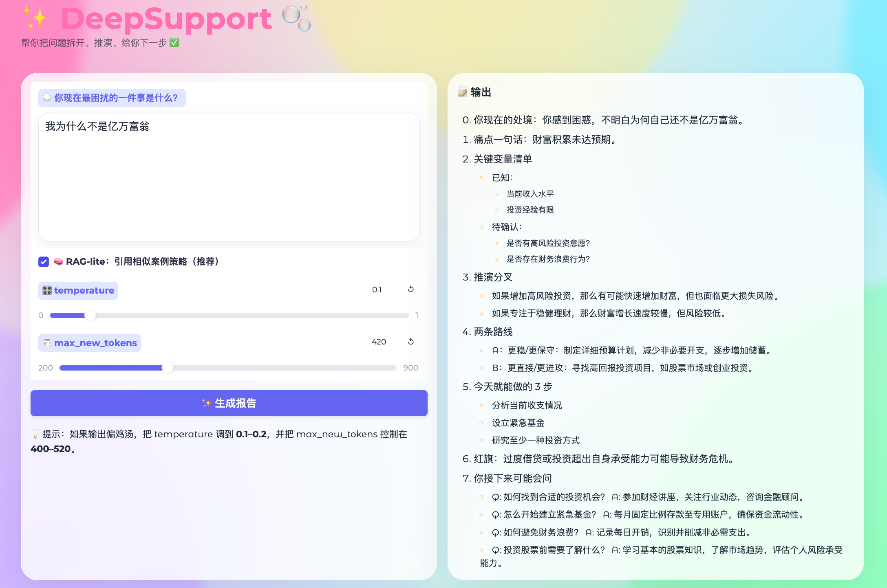

# DeepSupport 🧪
💪 DeepSupport is a problem-clarification and action-planning companion.  
✍️ Write your blockage, then get clarity, options, and next steps.





## What it does ✨
DeepSupport helps you move from a vague problem to a concrete next step:

- 🔎 Reflect and clarify what you’re truly stuck on.  
- 🧩 Break it down into key variables and options.  
- ✅ Generate a practical checklist you can execute immediately.  


## Beta Access 🔐
- 🌐 [Open demo](http://167.71.115.58:34821/)
- 📝 [Fill the form](https://forms.gle/xLgVwB7eDk7yWZDb8) to receive a username and password.

*Tip: Please enter your input in Chinese when possible. Multilingual support will be available in the near future.*


## Disclaimer ⚠️
DeepSupport is not professional advice, diagnosis, or consulting (medical, legal, financial, etc.).  
It provides structured thinking support and action planning. Please make your own decisions and consult qualified professionals when needed.


## Research and Citation 📚
If you use DeepSupport in a paper, report, thesis, or study, please cite this repository (beta stage):

```bibtex
@software{deepsupport_2025,
  author  = {Yuyan Chen},
  title   = {DeepSupport: A structured thinking companion for clarifying problems and generating next-step plans},
  year    = {2025},
  version = {beta},
  url     = {\url{https://github.com/Yukyin/DeepSupport}
}
```

*Tip: Please record your access date when referencing this beta. The system will be updated continuously.*


## License 📜
- Noncommercial use (including academic and research use) is governed by `LICENSE` (PolyForm Noncommercial 1.0.0).
- Commercial use requires a separate agreement — see `COMMERCIAL_LICENSE.md`.
- Copyright notice is provided in `NOTICE`.

📨 Commercial inquiries: yolandachen0313@gmail.com
