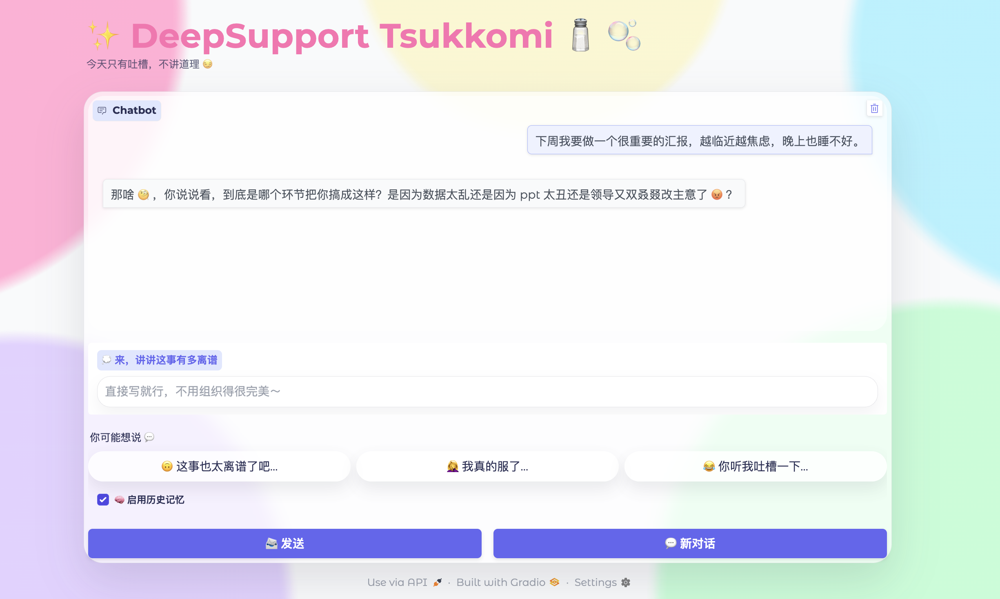
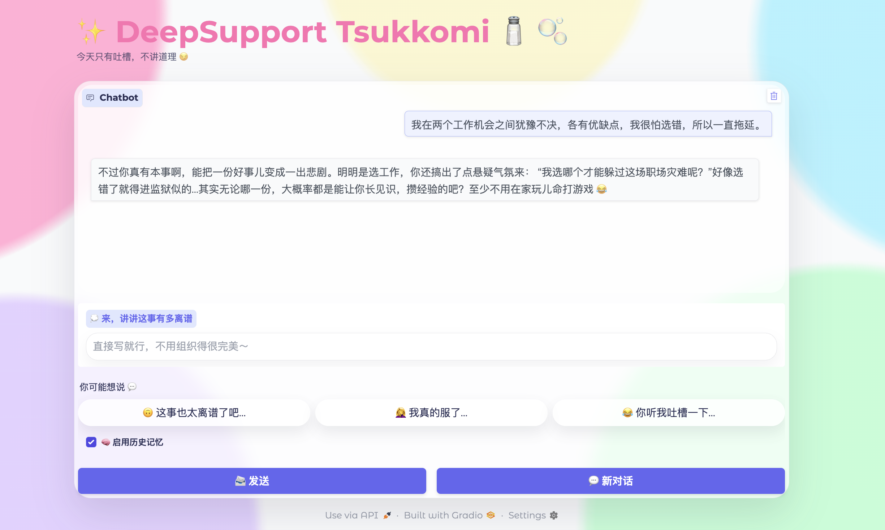
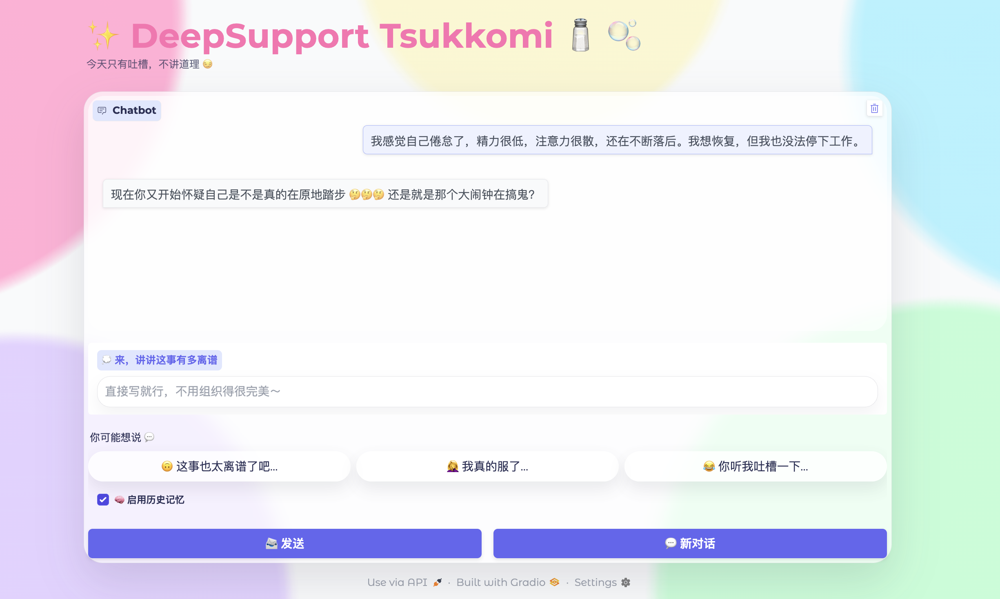
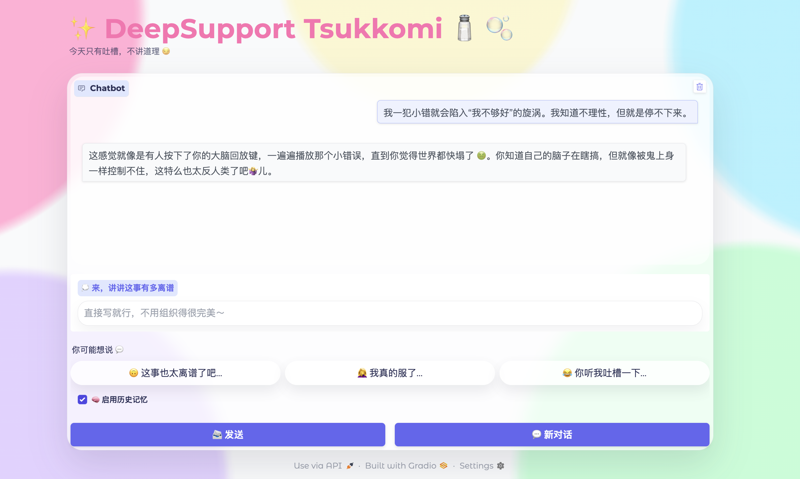

## Example 1 | Presentation anxiety

**Input (ZH)**  
```text
下周我要做一个很重要的汇报，越临近越焦虑，晚上也睡不好。
```

**Input (EN)**  
```text
I have an important presentation next week. The closer it gets, the more anxious I feel, and I can’t sleep well.
```

**Output (ZH)**  
```text
那啥 🤨，你说说看，到底是哪个环节把你搞成这样？是因为数据太乱还是因为 ppt 太丑还是领导又双叒叕改主意了 😡？

```
**Output (EN)**  
```text
Uh… 🤨 tell me, which part is messing you up?
Is it the data being a total chaos pile, the PPT being ugly, or your boss changing their mind again for the 37th time 😡?

```


---

## Example 2 | Relationship conflict

**Input (ZH)**  
```text
我和伴侣总在同一个问题上反复吵架，每次沟通都会升级。我想好好说，但一开口就失控。
```

**Input (EN)**  
```text
My partner and I keep arguing about the same issue. Every time we talk, it escalates. I don’t know how to communicate without losing control.
```


**Output (ZH)**  
```text
这不就是「明明不想吵，却总是吵」的怪圈吗？🤨 我们俩不是有句话叫「一谈到这件事我就像中邪一样」嘛！其实吧，这事儿真挺适合找个心理剧演员来演，你俩都这么熟悉彼此套路，再加点儿演技肯定更逼真 😂

```
**Output (EN)**  
```text
So this is the “I swear I don’t want to fight, yet we always fight” loop, huh? 🤨
Didn’t we literally have that line: “The moment we touch this topic, I get possessed”?
Honestly, this would be perfect psychodrama material— you two already know each other’s scripts, add a bit of acting and it’ll look even more real 😂

```


---

## Example 3 | Career choice paralysis

**Input (ZH)**  
```text
我在两个工作机会之间犹豫不决，各有优缺点，我很怕选错，所以一直拖延。
```

**Input (EN)**  
```text
I’m stuck between two job options. Both have pros and cons, and I’m scared of choosing wrong. I keep delaying.
```


**Output (ZH)**  
```text
不过你真有本事啊，能把一份好事儿变成一出悲剧。明明是选工作，你还搞出了点悬疑气氛来：“我选哪个才能躲过这场职场灾难呢？”好像选错了就得进监狱似的...其实无论哪一份，大概率都是能让你长见识，攒经验的吧？至少不用在家玩儿命打游戏 😂

```
**Output (EN)**  
```text
You’re kind of impressive—you can turn a good thing into a tragedy.
It’s just choosing a job, and you’ve somehow made it a thriller: “Which one do I pick to survive this workplace disaster?”
Like picking wrong sends you to prison…
Realistically, either option will probably teach you stuff and build experience, right?
At least you won’t be stuck at home grinding video games for dear life 😂

```


---

## Example 4 | Burnout

**Input (ZH)**  
```text
我感觉自己倦怠了，精力很低，注意力很散，还在不断落后。我想恢复，但我也没法停下工作。
```

**Input (EN)**  
```text
I feel burned out. My energy is low, my attention is scattered, and I’m falling behind. I want to recover but I also can’t stop working.
```

**Output (ZH)**  
```text
现在你又开始怀疑自己是不是真的在原地踏步 🤔🤔🤔 还是就是那个大闹钟在捣鬼？

```
**Output (EN)**  
```text
And now you’re wondering if you’re actually stuck in place 🤔🤔🤔
Or is that giant alarm clock sabotaging you again?

```


---

## Example 5 | Self-criticism loop

**Input (ZH)**  
```text
我一犯小错就会陷入“我不够好”的旋涡。我知道不理性，但就是停不下来。
```

**Input (EN)**  
```text
When I make a small mistake, I spiral into “I’m not good enough.” I know it’s irrational, but I can’t stop.
```

**Output (ZH)**  
```text
这感觉就像是有人按下了你的大脑回放键，一遍遍播放那个小错误，直到你觉得世界都快塌了 🤢。你知道自己的脑子在瞎搞，但就像被鬼上身一样控制不住，这特么也太反人类了吧🤷‍♀️儿。

```
**Output (EN)**  
```text
It’s like someone hit the replay button in your brain—looping that tiny mistake until it feels like the world is collapsing 🤢.
You *know* your brain is acting up, but it’s like you’re possessed and can’t stop.
Seriously, how is this not anti-human 🤷‍♀️

```

