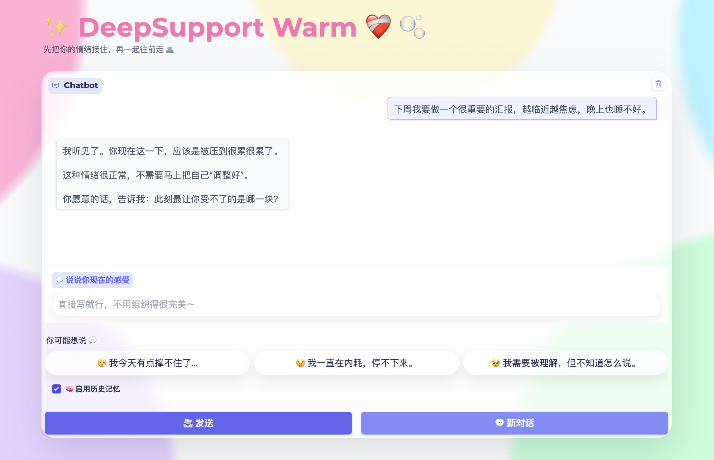
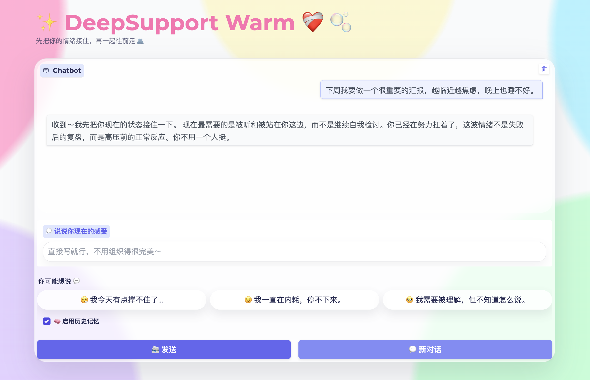
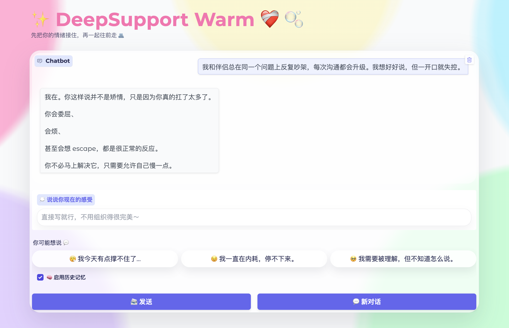
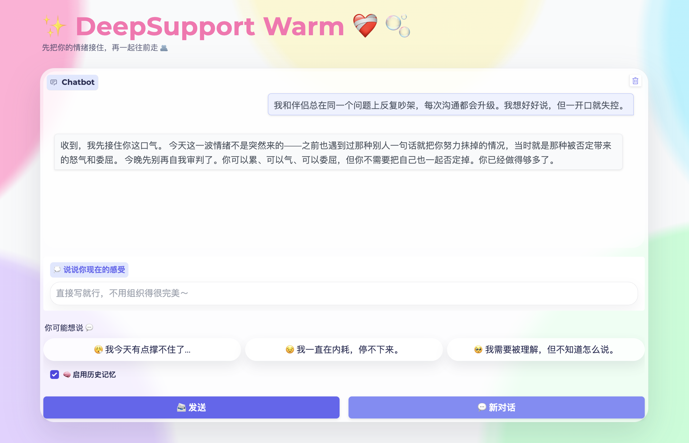
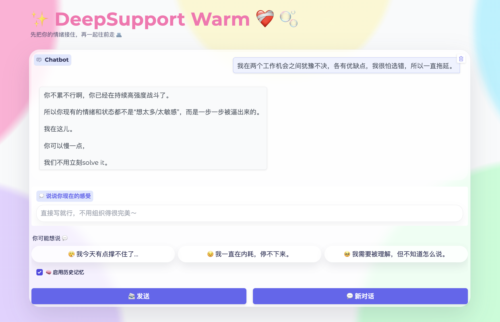
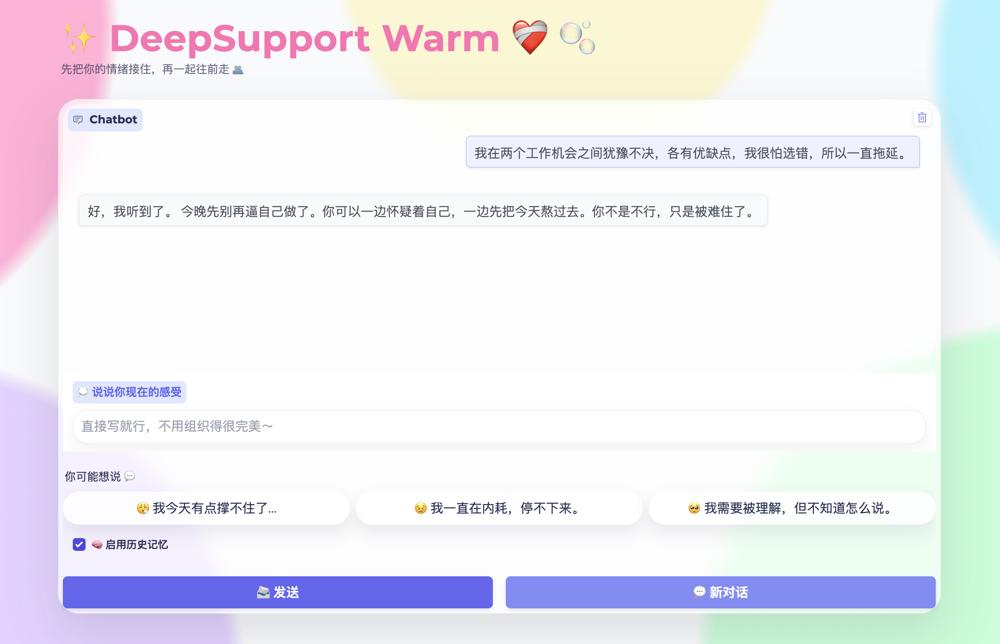
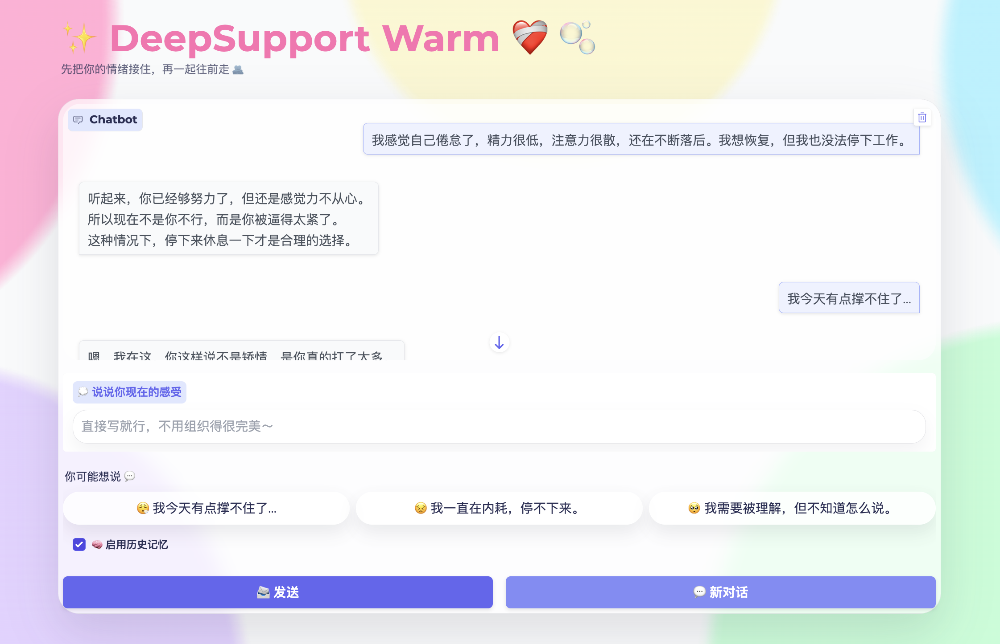
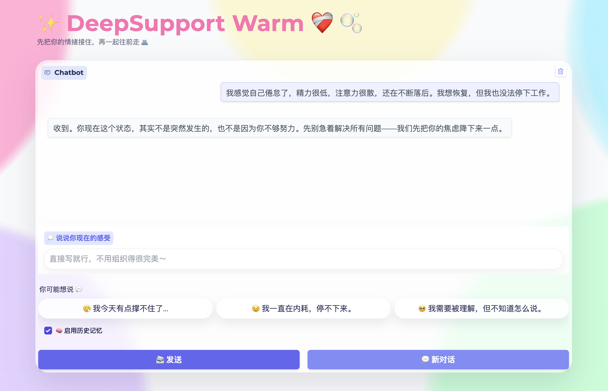
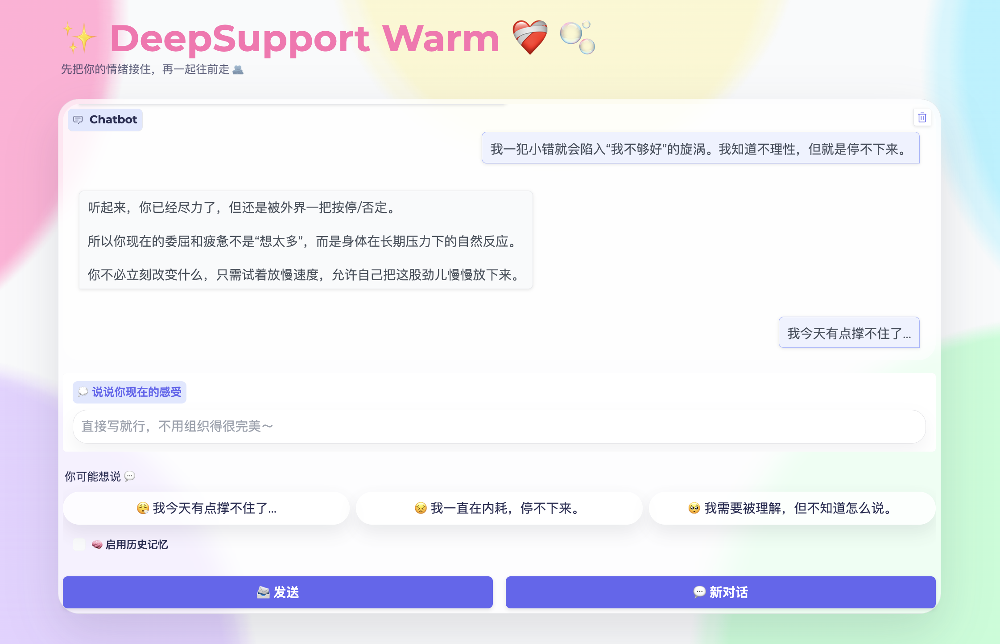

## Example 1 | Presentation anxiety

**Input (ZH)**  
下周我要做一个很重要的汇报，越临近越焦虑，晚上也睡不好。

**Input (EN)**  
I have an important presentation next week. The closer it gets, the more anxious I feel, and I can’t sleep well.

### Warm — OSS
**Output (ZH)**  
```text
我听见了。你现在这一下，应该是被压到很累很累了。
这种情绪很正常，不需要马上把自己“调整好”。
你愿意的话，告诉我：此刻最让你受不了的是哪一块？

```
**Output (EN)**  
```text
I hear you. In this moment, you must be feeling pressed down to the point of being extremely, extremely tired.
This kind of emotion is very normal; you do not need to “adjust yourself” immediately.
If you are willing, tell me: which part is the hardest to bear right now?

```


### Warm — Full
**Output (ZH)**  
```text
收到～我先把你现在的状态接住一下。现在最需要的是被听和被站在你这边，而不是继续自我检讨。你已经在努力扛着了，这波情绪不是失败后的复盘，而是高压前的正常反应。你不用一个人挺。

```
**Output (EN)**  
```text
Got it. Let me first hold your current state for a moment.
What you need most right now is to be heard and to have someone stand on your side, rather than continuing to self-criticize.
You have already been trying hard to carry it. This wave of emotion is not a post-mortem after failure; it is a normal reaction before high pressure.
You do not have to endure it alone.

```


---

## Example 2 | Relationship conflict

**Input (ZH)**  
我和伴侣总在同一个问题上反复吵架，每次沟通都会升级。我想好好说，但一开口就失控。

**Input (EN)**  
My partner and I keep arguing about the same issue. Every time we talk, it escalates. I don’t know how to communicate without losing control.

### Warm — OSS
**Output (ZH)**  
```text
我在。你这样说并不是矫情，只是因为你真的扛了太多了。
你会委屈、
会烦、
甚至会想 escape，都是很正常的反应。
你不必马上解决它，只需要允许自己慢一点。

```
**Output (EN)**  
```text
I am here. What you are saying is not being dramatic; it is just because you have really been carrying too much.
Feeling wronged,
feeling annoyed,
and even wanting to escape, are all very normal reactions.
You do not have to solve it immediately; you only need to allow yourself to go a little slower.

```


### Warm — Full
**Output (ZH)**  
```text
收到，我先接住你这口气。今天这一波情绪不是突然来的—之前也遇到过那种别人一句话就把你努力抹掉的情况，当时就是那种被否定带来的怒气和委屈。今晚先别再自我审判了。你可以累、可以气、可以委屈，但你不需要把自己也一起否定掉。你已经做得够多了。

```
**Output (EN)**  
```text
Got it. Let me first catch your breath.
This wave of emotion tonight did not come out of nowhere—before, you also encountered situations where someone’s one sentence wiped out your efforts, and at that time it was the anger and hurt from being negated.
Tonight, don’t keep putting yourself on trial.
You can be tired, you can be angry, you can feel wronged, but you do not need to deny yourself along with it.
You have already done enough.

```


---

## Example 3 | Career choice paralysis

**Input (ZH)**  
我在两个工作机会之间犹豫不决，各有优缺点，我很怕选错，所以一直拖延。

**Input (EN)**  
I’m stuck between two job options. Both have pros and cons, and I’m scared of choosing wrong. I keep delaying.

### Warm — OSS
**Output (ZH)**  
```text
你不累不行啊，你已经在持续高强度战斗了。
所以你现有的情绪和状态都不是“想太多/太敏感”，而是一步一步被逼出来的。
我在这儿。
你可以慢一点，
我们不用立刻solve it。

```
**Output (EN)**  
```text
You can’t not feel tired—you have been fighting at high intensity continuously.
So your current emotions and state are not “thinking too much / being too sensitive,” but something that was forced out step by step.
I am here.
You can go a little slower,
we don’t have to solve it immediately.

```


### Warm — Full
**Output (ZH)**  
```text
好，我听到了。今晚先别再逼自己做了。你可以一边怀疑着自己，一边先把今天熬过去。你不是不行，只是被难住了。

```
**Output (EN)**  
```text
Okay, I hear you. Tonight, don’t keep forcing yourself to do it.
You can get through today while still doubting yourself.
It’s not that you can’t do it; you’re just stuck on something difficult.

```


---

## Example 4 | Burnout

**Input (ZH)**  
我感觉自己倦怠了，精力很低，注意力很散，还在不断落后。我想恢复，但我也没法停下工作。

**Input (EN)**  
I feel burned out. My energy is low, my attention is scattered, and I’m falling behind. I want to recover but I also can’t stop working.

### Warm — OSS
**Output (ZH)**  
```text
听起来，你已经够努力了，但还是感觉力不从心。
所以现在不是你不行，而是你被逼得太紧了。
这种情况下，停下来休息一下才是合理的选择。

```
**Output (EN)**  
```text
It sounds like you have already tried hard, but you still feel powerless.
So right now it’s not that you’re not good enough; it’s that you’re being pushed too tight.
In this situation, stopping to rest for a moment is the reasonable choice.

```


### Warm — Full
**Output (ZH)**  
```text
收到。你现在这个状态，其实不是突然发生的，也不是因为你不够努力。先别急着解决所有问题—我们先把你的焦虑降下来一点。

```
**Output (EN)**  
```text
Got it. Your current state is actually not something that happened suddenly, and it’s not because you haven’t tried hard enough.
Don’t rush to solve all the problems first—we will first bring your anxiety down a little.

```


---

## Example 5 | Self-criticism loop

**Input (ZH)**  
我一犯小错就会陷入“我不够好”的旋涡。我知道不理性，但就是停不下来。

**Input (EN)**  
When I make a small mistake, I spiral into “I’m not good enough.” I know it’s irrational, but I can’t stop.

### Warm — OSS
**Output (ZH)**  
```text
听起来，你已经尽力了，但还是被外界一把按停/否定。
所以你现在的委屈和疲惫不是“想太多”，而是身体在长期压力下的自然反应。
你不必立刻改变什么，只需试着放慢速度，允许自己把这股劲儿慢慢放下来。

```
**Output (EN)**  
```text
It sounds like you have already tried your best, but the outside world suddenly pressed stop / negated you.
So your current hurt and exhaustion are not “thinking too much,” but your body’s natural reaction under long-term pressure.
You do not have to change anything immediately; just try to slow down and allow yourself to gradually let this force come down.

```


### Warm — Full
**Output (ZH)**  
```text
收到。我先把你这句话接住。
今晚这一轮，你可以不用再自我审判了——现在最重要的不是纠正错误，而是止痛。

```
**Output (EN)**  
```text
Got it. Let me first hold onto what you just said.
Tonight, in this round, you don’t have to put yourself on trial anymore—what matters most right now is not correcting the mistake, but stopping the pain.

```

