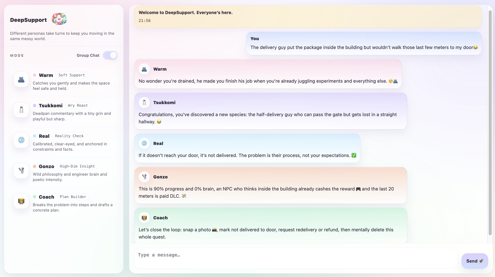

# DeepSupport 

DeepSupport is a multi-mode companion for supportive dialogue:

- 🫂 **DeepSupport Warm** is an emotional-holding companion that offers gentle support without rushing into what to do next.

- 🧂 **DeepSupport Tsukkomi** is a wry roast-and-reframe companion that uses deadpan humor to help you vent, zoom out, and regain perspective without forcing serious advice mode.

- 🌐 **DeepSupport Real** is a calibrated reality-check companion that anchors the conversation in constraints and facts while keeping the tone protective and steady.

- 🌪️ **DeepSupport Gonzo** is a high-dimensional insight companion that uses wild, poetic analogies to untangle complex feelings and reveal the hidden structure of a messy situation.

- 🧑‍🏫 **DeepSupport Coach** is a problem-clarification and action-planning companion that turns vague blockages into concrete next steps.

Different personas take turns to keep you moving in the same messy world.



A complete screen recording of a live two-turn group-chat session with all five personas responding concurrently is available [here](ds-group.mp4).

## Quickstart 🚀

- **DeepSupport Warm** → `DeepSupport_Warm/`  
  Read the Warm README: **[`DeepSupport_Warm/README.md`](DeepSupport_Warm/README.md)**

- **DeepSupport Tsukkomi** → `DeepSupport_Tsukkomi/`  
  Read the Tsuk README: **[`DeepSupport_Tsukkomi/README.md`](DeepSupport_Tsukkomi/README.md)**

- **DeepSupport Real** → `DeepSupport_Real/`  
  Read the Real README: **[`DeepSupport_Real/README.md`](DeepSupport_Real/README.md)**

- **DeepSupport Gonzo** → `DeepSupport_Gonzo/`  
  Read the Gonzo README: **[`DeepSupport_Gonzo/README.md`](DeepSupport_Gonzo/README.md)**

- **DeepSupport Coach** → `DeepSupport_Coach/`  
  Read the Coach README: **[`DeepSupport_Coach/README.md`](DeepSupport_Coach/README.md)**


## Availability 💡

- The OSS releases do not ship any private datasets or real chat logs.

- DeepSupport Warm is best used with [the fine-tuned LoRA adapter](https://huggingface.co/Yukyin/deepsupport-warm-lora-oss).

- DeepSupport Tsukkomi, Real, Gonzo are highly dependent on their training data, so they are not open-sourced for now.  They will be exposed later via an interface.

- DeepSupport Coach is a prompt-based method best with in-context learning data and requires no additional training.

- [UPDATE!] We now open-source a representative sample of the dataset, including 62 dialogue pairs across all five personas, with Chinese–English parallel annotations at https://huggingface.co/datasets/Yukyin/DeepSupport.


## Disclaimer ⚠️

- DeepSupport does not provide professional advice, diagnosis, or therapy. 

- It provides supportive conversation and perspective in its own style. Please seek qualified professional help when needed.


## Research and Citation 📚

If you use DeepSupport in a paper, report, thesis, or study, please cite this repository:

```bibtex
@misc{deepsupport2026,
  author  = {Yuyan Chen},
  title   = {DeepSupport: A Multi-Perspective Self-Discovery Dialogue Dataset},
  year    = {2026},
  url     = {\url{https://github.com/Yukyin/DeepSupport}}
}
```


## License 📜

Noncommercial use is governed by `LICENSE` (PolyForm Noncommercial 1.0.0).  
Commercial use requires a separate agreement — see `COMMERCIAL_LICENSE.md`.

📨 Commercial inquiries: yolandachen0313@gmail.com


